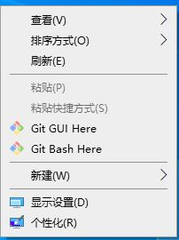
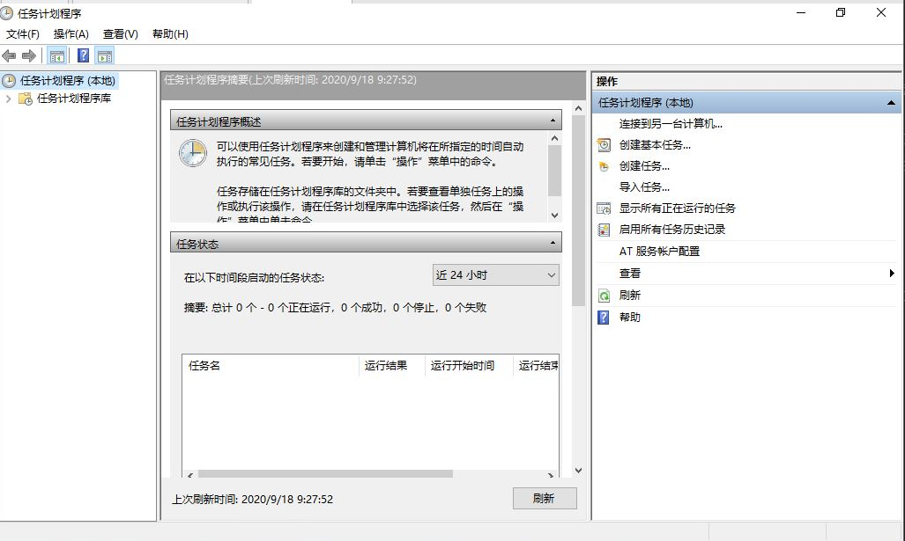
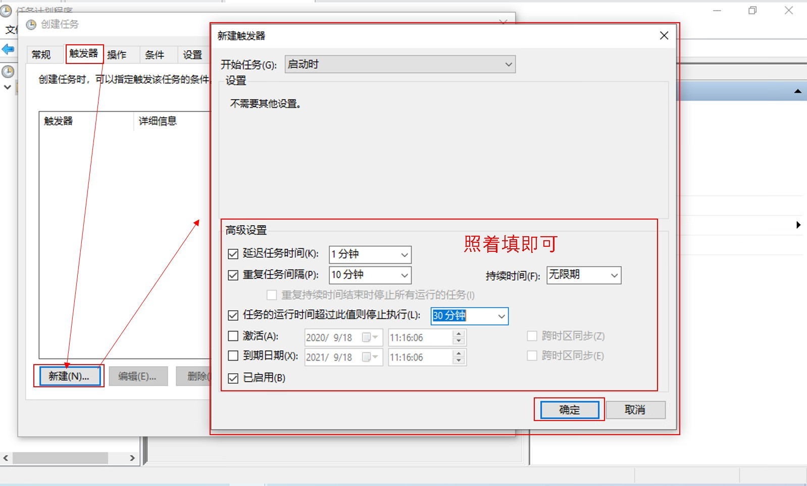
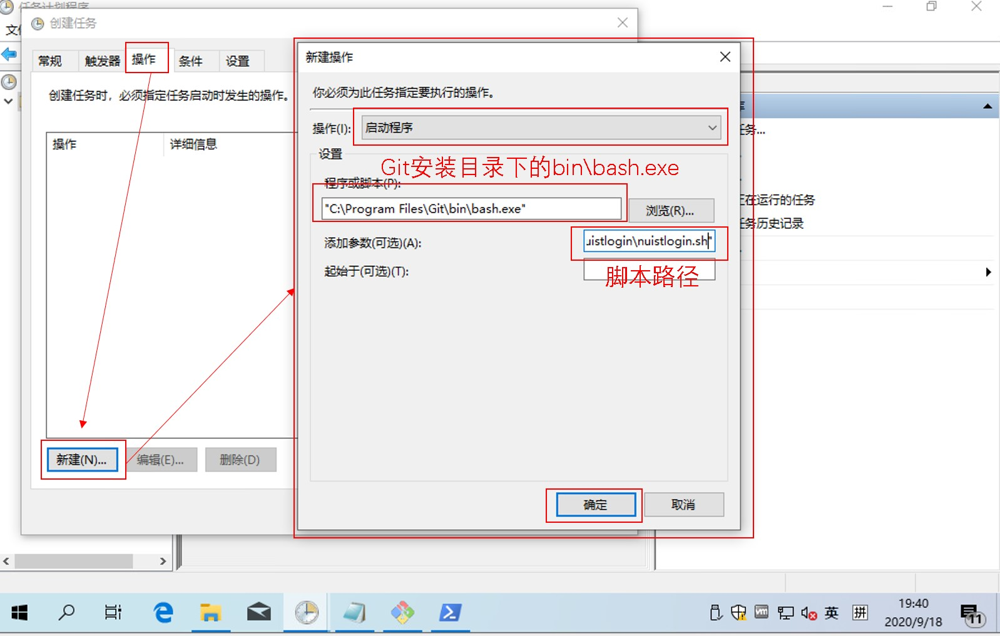
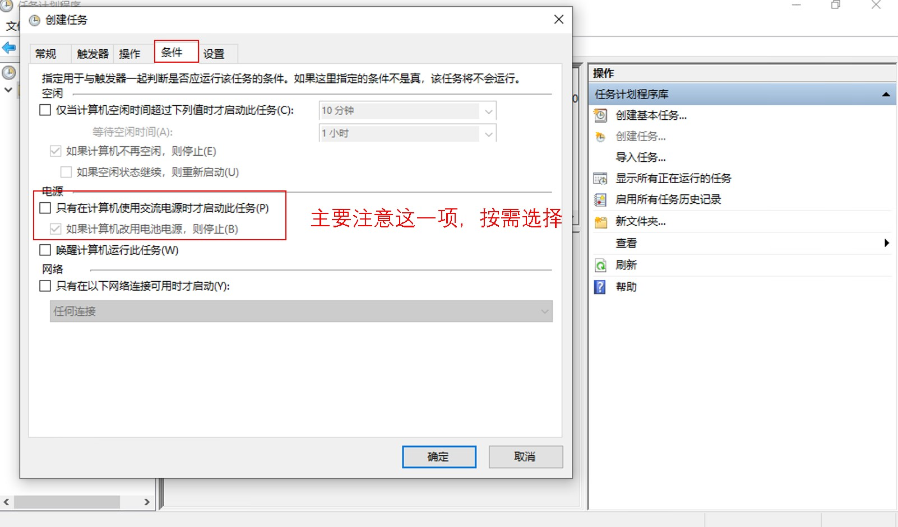
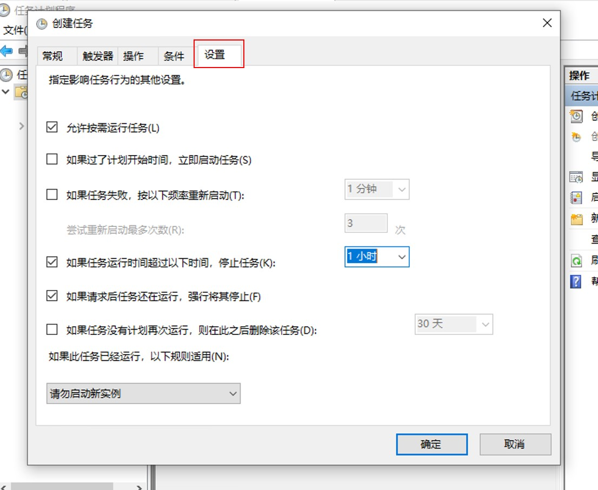

# NUISTNet

## 简介

南京信息工程大学网络自动登陆脚本，可以免去每天都要联网的麻烦。

使用该脚本需要使用有线连接到校园网络或者使用无线连接，在有条件的情况下请尽可能使用有线连接，

该脚本拥有自动模式、强制登录、强制下线、状态查询的功能。在自动模式下，该脚本会检测目前的联网状态，在网络断开时会尝试登录，将其作为定时程序可在网络断开后自动重新连接，以应对断电等突发情况。

由于个人习惯问题，脚本使用`bash`语言编写。如果喜欢`Python`或其他语言编写的一键登录脚本，可转置文末的致谢部分，罗列了一些前辈们写的类似程序，可自行测试。

## 声明

本脚本仅供研究、学习、交流使用，对使用本项目造成的后果，本人不承担任何责任。

## 脚本参数

假设脚本被命名为`nuistnet.sh`，并且当前工作目录为脚本放置位置，脚本拥有执行权限，脚本的调用参数如下：

命令|功能
--|--
./nuistnet.sh|执行检测，断网时尝试登录
./nuistnet.sh login|强制登录(不进行联网检测)
./nuistnet.sh logout|登出
./nuistnet.sh status|登录情况查询
./nuistnet.sh help|显示帮助信息

## 脚本效果展示(Linux环境下)

+ 执行检测，断网时尝试登录

```shell
    ubuntu@nt:~/Documents/netlogin$ ./nuistnet.sh
    测试网络通断...
    网络断开，尝试连接登录服务器...
    进行登录...
    登录成功！
    账户：  15********
    ISP：   中国移动
    IP：    10.11.**.**
```

```shell
    ubuntu@nt:~/Documents/netlogin$ ./nuistnet.sh
    测试网络通断...
    已经联网，退出。
```

+ 强制登录

```shell
    ubuntu@nt:~/Documents/netlogin$ ./nuistnet.sh login
    强制登录...
    登录成功！
    账户：  15********
    ISP：   中国移动
    IP：    10.11.**.**
```

```shell
    ubuntu@nt:~/Documents/netlogin$ ./nuistnet.sh login
    强制登录...
    登录失败。
    信息：  用户已登录
```

+ 登录情况查询

```shell
    ubuntu@nt:~/Documents/netlogin$ ./nuistnet.sh status
    获取登录信息...
    状态：  已经登陆
    账户：  15********
    ISP：   中国移动
    IP：    10.11.**.**
    时长：  172s
```

```shell
    ubuntu@nt:~/Documents/netlogin$ ./nuistnet.sh status
    获取登录信息...
    未登录
    信息：  用户未登录
```

+ 登出

```shell
    ubuntu@nt:~/Documents/netlogin$ ./nuistnet.sh logout
    退出登录...
    登出成功
    信息：  退出成功
```

```shell
    ubuntu@nt:~/Documents/netlogin$ ./nuistnet.sh logout
    退出登录...
    登出失败。
    信息：  用户已退出
```

## 脚本依赖

脚本依赖于`bash`执行环境以及`curl`网络工具，在Linux环境与Windows的`Git-bash`环境下完成测试。对于定时任务，Linux环境下可用`crond`实现，Windowns环境下可使用`任务计划程序(Task Scheduler)`实现。对于上述两种环境，会给出具体的配置方法。由于本人没有Mac OS环境，无法测试脚本在该系统环境下的可用性。根据网络上的相关资料，Mac OS是拥有`Bash`环境与`curl`软件包的，理论上也是可以运行的。

## 依赖安装

### Windows

其他Windows下的`bash`环境模拟器也是可以运行的，本人没有进行相关测试。这里只描述`Git-bash`环境的安装。

前往以下地址下载`Git`安装包：[https://git-scm.com/downloads](https://git-scm.com/downloads)。

随后运行下载的安装包，可能需要修改的是安装位置，如下图，可以根据自己的习惯进行修改，其余保持默认即可。一路下一步直到安装完成。


安装完成后会在所有程序中出现文件夹`Git`，其中的`Git Bash`即是本脚本所依赖的执行环境。打开后如下图：


此外，在资源管理器的右击菜单中，会出现`Git Bash Here`选项，如下图。该选项可以在当前位置打开`Git Bash`环境，方便程序的调试。



### Linux

建议修改软件源为国内镜像，加速下载。例如[中科大软件镜像](https://mirrors.ustc.edu.cn)与[清华软件镜像](https://mirrors.tuna.tsinghua.edu.cn)

对于Debian系发行版(Debian、Ubuntu、Raspberry Pi OS等)，使用以下命令安装(大部分发行版都已经安装了)：

`sudo apt install curl cron`

对于Red Hat系发行版(CentOS等)，使用以下命令安装(大部分发行版都已经安装了):

`sudo yum install curl cronie`

## 脚本部署

### Windows

`Windows`环境下的脚本为：`nuistnet_Windows.sh`，将其放置于一个你习惯的位置(建议路径使用全英文，如`E:\Program Files\Scripts\`)，并重命名为`nuistnet.sh`。

随后使用编辑器打开该文件，修改开头的以下变量为你的账户信息(即你在`a.nuist.edu.cn`中输入的信息)：

变量|说明
--|--
username|登录校园网
password|用户密码
isp|网络提供商的代码

其中，网络提供商(isp，即登录窗口的`@`选项)字段的对应代码如下，大小写敏感：

代码|网络提供商
--|--
CMCC|中国移动
Unicom|中国联通
ChinaNet|中国电信
NUIST|南京信息工程大学

例如，你的账号为`123456`，密码为`54321`，在中国移动办理的网络，相关字段修改为：

```shell
username='123456'
password='54321'
isp='CMCC'
```

保存该文件，双击运行该文件即可实现检测网络并自动登录的功能，如果配置一切正常，应该会输出类似于脚本效果展示中的效果，并且成功联网。

另外，在测试时，可以先在当前位置`右击-Git Bash here`，使用`./nuistnet.sh`运行脚本，可以将输出留在窗口中方便调试。

此外，如果对于登出、状态查询功能有需求的，可以尝试其他命令。由于考虑到使用本脚本的都是希望保持网络长期在线的用户，在此不再阐述。

### Linux

`Linux`环境下的脚本为`nuistnet_Linux.sh`，将其放置于一个你习惯的位置(本人存放在当前用户家目录下的`bin`文件夹)，并重命名为`nuistnet.sh`。

使用一个你熟悉的编辑器编辑脚本(新手推荐使用`nano`)，参考上文中`Windows`部署的相关内容修改变量，并保存。

给该文件可执行的权限`chmod +x ./nuistnet.sh`，随后执行该脚本`./nuistnet.sh`。如果配置一切正常，应该会输出类似于脚本效果展示中的效果，并且成功联网。

## 定时执行部署

### Windows

打开任务计划程序(可以使用搜索功能打开)，如下图：



选择创建任务、按照如下图示填写相关信息。

+ 常规


+ 触发器



其中的重复任务间隔可根据自己的实际情况填写，在频繁断网断电的情况下可以适当减小数值。

+ 操作



其意义为，使用`bash.exe`程序执行自定义的脚本。

+ 条件



对于大多数使用场景，可以去除该选项。另外，执行该脚本消耗的资源极少，无需担心对续航产生影响。

+ 设置



这里保持默认即可。

完成后，会要求输入当前用户的密码，以验证身份。

如果配置正常，系统重启后，脚本便会定时检查是否联网，如果网络断开就尝试登陆操作。

### Linux

进入命令行，使用`crontab -e`命令打开编辑器，在最后一行添加如下内容：

```shell
*/5 * * * * "/home/ubuntu/bin/nuistnet.sh" >/dev/null 2>&1
```

该行的意思为，每隔5分钟检测一次网络，如果网络不通就尝试登陆。其中后面双引号内为脚本路径，需要注意的是用户需要有该脚本的执行权限。

随后保存并退出，脚本便会定时检查是否联网，如果网络断开就尝试登陆操作。

`crontab`配置的生成可以使用[Crontab Generator](https://crontab-generator.org/)网站提供的服务。

## 推荐用途

我制作该脚本的用意为，利用路由器划设自己的局域网，接入该局域网的设备可以被上层(校园网)视为一台设备，只需在局域网中的任意一台设备上进行登录，其余设备即可联网，便于自己多设备的联网，也可与舍友合租网络，节约资金(毕竟目前校园带宽50M起步，4-6人共享基本没问题)。

以下是我目前的网络拓扑，可供参考。


其中，本脚本被部署于通过有线连接到路由器Lan口的一台主机上，即可保证其余设备的可靠联网。

另外，主机无需是x86架构的电脑，完全可以使用树莓派、刷了Armbian的斐讯N1盒子等Arm架构的低功耗设备(我部署在了树莓派上)，有需求的还可以安装下载软件，当个离线下载、私人网盘使用。不过，这类设备基本上使用Linux系统，入门门槛较高。

## 可能出现的问题

由于本人仅有中国移动的账号，对于其他类型的账号未做测试。

## 致谢

本项目受到以下项目的启发，感谢各位前辈所做的相关工作。

https://github.com/needhourger/stupidwifi

https://github.com/Alrash/WebAuthenticate

https://github.com/RRRRRm/nuistconnect

https://github.com/Blacate/Web-Authentication-for-iNuist

https://github.com/Carrgan/NUISTNetLogin

## 许可证

本项目使用MIT许可证。
